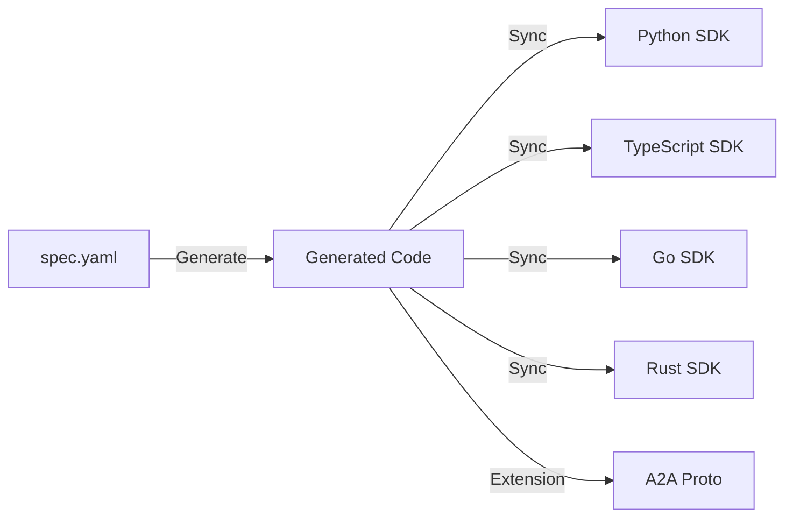

# HCT Specification

**The Single Source of Truth for Harmonic Coordination Theory signals.**

---

## 📖 Documentation

The full semantic specification, including signal definitions, protocol bindings, and usage guides, is available at:

👉 **[HCT Signal Specification (stefanwiest.de)](https://stefanwiest.de/research/specification)**

---

## 🏗️ Architecture

This repository defines the canonical data structures for HCT. It serves as the build root for the entire ecosystem.

## 📂 Repository Structure

| File | Purpose |
|------|---------|
| `spec.yaml` | **Master Definition**. Edit this file to change the spec. |
| `schema.json` | JSON Schema (Draft 2020-12), auto-generated. |
| `generated/` | Polyglot type definitions (do not edit manually). |
| `scripts/` | Generation logic (Python). |

## 📦 Generated Outputs

When `spec.yaml` is modified, CI automatically regenerates and pushes to downstream repositories:

*   **Python**: `hct-mcp-signals` (Pydantic models)
*   **TypeScript**: `@hct-mcp/signals` (Interfaces & Enums)
*   **Go**: `hct-mcp-signals` (Structs)
*   **Rust**: `hct-mcp-signals` (Enums)
*   **Protobuf**: `hct-a2a` (gRPC definitions)

## 🤝 Contributing

1.  Modify `spec.yaml`.
2.  Run `Justfile` or `python scripts/generate.py`.
3.  Commit changes.
4.  Open a PR.

**Note**: Do not manually edit files in `generated/` or `schema.json`. They will be overwritten.

## License

Apache 2.0
